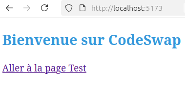
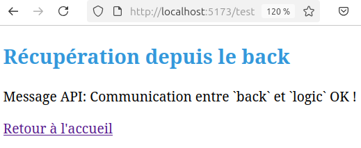
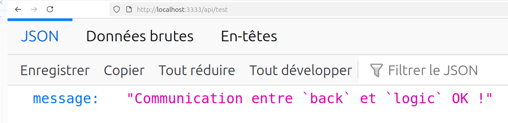

# Documentation : Communication entre Backend, Logic et Frontend

## 1. Vue d’ensemble

Le projet suit une architecture en trois couches distinctes, chacune ayant un rôle précis :

    Backend (Express.js, Node.js) : API REST qui gère les requêtes du Frontend et appelle Logic pour le traitement des données.
    Logic (Node.js, TypeScript) : Service indépendant qui effectue des transformations de données demandées par le Backend.
    Frontend (Vue.js, Vite) : Affiche l’interface utilisateur et envoie des requêtes HTTP au Backend.

Chaque couche communique via des requêtes HTTP et fonctionne indépendamment, garantissant une séparation des responsabilités claire (SoC).

---

## 2. Fonctionnement détaillé

### 1. L'utilisateur interagit avec **Frontend**

- L’utilisateur accède à http://localhost:5173/ (port 5173).
- Le Frontend affiche une page et envoie une requête fetch() au Backend (http://localhost:3333/api/test).

### 2. **Communication Frontend → Backend**

- Le Frontend envoie une requête HTTP GET /api/test au Backend (Express.js).
- Le **Backend** reçoit cette requête et doit traiter une donnée via `Logic`.

### 3. **Communication Backend → Logic**

- **Le Backend ne traite pas lui-même la donnée.**
- Il envoie une requête GET http://localhost:3333/api/test pour exécuter une logique métier via Logic.
- Le **service Logic** reçoit la requête et génère une réponse en JSON.

### 4. **Logic répond au Backend**

- Logic répond avec une réponse JSON :
  ```json
  { "message": "Communication entre `back` et `logic` OK !" }
  ```
- **Le Backend récupère cette réponse et la renvoie au Frontend.**

### 5. **Backend → Frontend**

- Backend retourne `"Communication entre `back`et`logic` OK !"` à Frontend, qui l'affiche à l’écran.

---

## 3. Schéma du cheminement

Représentation simplifiée du fonctionnement :

```
Utilisateur ⇄ Frontend (Vue.js) ⇄ Backend (Express.js) ⇄ Logic (Node.js)
```

1. **L’utilisateur accède à frontend** (`http://localhost:5173/`).
2. **Frontend envoie une requête** à Backend (`http://localhost:3333/api/test`).
3. **Backend appelle Logic**
4. **Logic traite et renvoie la donnée** (`{ "message": "Communication entre backetlogic OK !" }`).
5. **Backend retourne "Communication entre `back` et `logic` OK !" à Frontend**, qui l’affiche sur la page.

---

## 4. Exemple de requêtes

### Requête envoyée par **Frontend** au **Backend**

```javascript
fetch("http://localhost:3333/api/test")
  .then((response) => response.json())
  .then((data) => console.log("Réponse du backend:", data.message));
```

### Requête Requête exécutée par le **Backend**

```typescript
import express from "express";
import cors from "cors";
import dotenv from "dotenv";

dotenv.config();
const app = express();

app.use(cors());
app.use(express.json());

app.get("/api/test", (req, res) => {
  const message = { message: "Communication entre `back` et `logic` OK !" };
  res.json(message);
});

app.listen(3333, () => {
  console.log("Server running on port 3333");
});
"
```

### Réponse de **Logic**

```json
{ "message": "Communication entre `back` et `logic` OK !" }
```

---

## 5. Résumé

✔ **Frontend envoie une requête à Backend** (`http://localhost:3333/api/test`).  
✔ **Backend demande un traitement à Logic**.
✔ **Logic traite et renvoie la donnée (`"Communication entre back et logic OK !"`).**  
✔ **Backend retourne `"HELLO"` à Frontend, qui l'affiche.**




